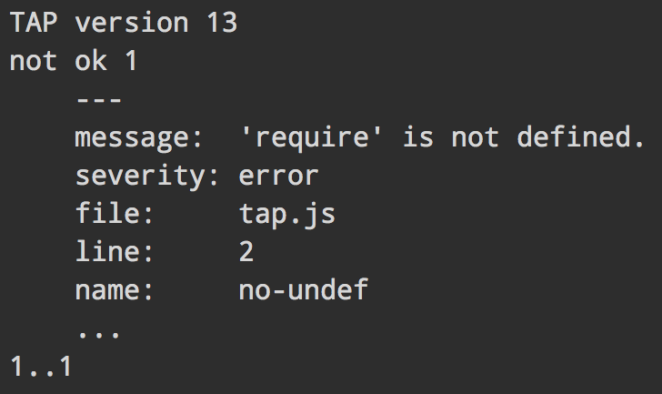

# eslint-tap

[TAP](http://testanything.org) formatter for [ESLint](http://eslint.org)

> TAP, the Test Anything Protocol, is a simple text-based interface between testing modules in a test harness. TAP started life as part of the test harness for Perl but now has implementations in C/C++, Python, PHP, Perl and probably others by the time you read this.




## Install

```
$ npm install --save-dev eslint-tap
```


## Usage

#### ESLint CLI

```
$ eslint --format=node_modules/eslint-tap file.js
```

#### [grunt-eslint](https://github.com/sindresorhus/grunt-eslint)

```js
grunt.initConfig({
	eslint: {
		options: {
			format: 'node_modules/eslint-tap'
		},
		target: ['file.js']
	}
});

grunt.loadNpmTasks('grunt-eslint');
grunt.registerTask('default', ['eslint']);
```


## License

MIT © [Sindre Sorhus](https://sindresorhus.com)
